  

   
   

  <h3><code>pguilheerme@github ~ $ whoami</code></h3>

   
   

  

<h3>About me</h3>

Software developer focused on building modern, scalable 
and useful applications.

 

I work across web development, backend systems, 
databases and data-driven solutions, always exploring 
new technologies and turning real-world problems 
into software.

 

Currently working with technologies such as React, 
TypeScript, NestJS, PostgreSQL and modern web 
architectures.

 

 

   
   

  <h3><code>pguilheerme@github ~ $ ./contributions.sh</code></h3>

   
   

  <h3><code>pguilheerme@github ~ $ ls ./stack</code></h3>

   
   
   

  <h3><code>pguilheerme@github ~ $ ./connect.sh</code></h3>

  
  &nbsp;
  
  &nbsp;
  

   
   

<code>Thanks for visiting. See you around! 👋</code>

